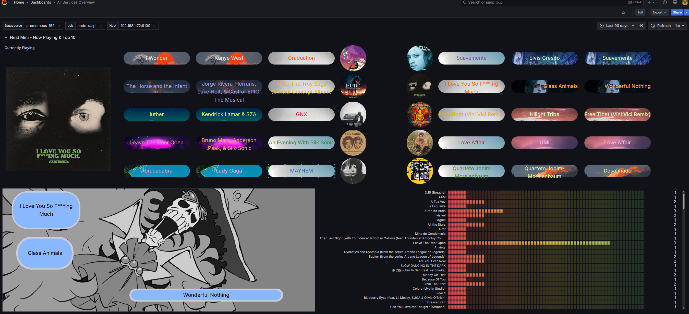
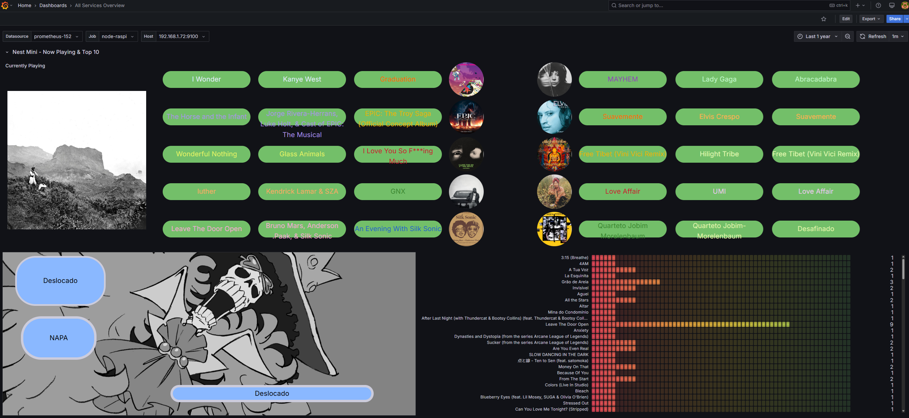

Chromecast / Nest Mini Prometheus exporter with play history, Top 10 metrics, and album-art image relay for use in Grafana dashboards.




Polls a Google Nest Mini (or any Chromecast audio device) for:
-Now playing title, artist, album, album art URL, playback state
-Persists song play counts to JSON

has:
  - /nowplaying 
  - /metrics with current track + historical play counts
  - /metrics w/ top 10 most played songs
- Downloads and serves album art images
- Serves background images for dashboards

If you're going to use the grafana dashboard example I provided, make sure to get the Dynamic Image Panel Grafana plugin:
https://grafana.com/grafana/plugins/dalvany-image-panel/

you can also start/stop the service from a termux launch/script widget on your android phone.
example scripts in ~/.shortcuts/ on your phone:
```bash
# ~/.shortcuts/Enable-NestMonitor
ssh PiZero "sudo systemctl enable --now nest_mini_exporter_check_sh_script.timer && sudo systemctl start nest_mini_exporter_check_sh_script.service && sudo systemctl start nest-mini-exporter.service && echo 'Nest Mini monitor enabled.'"

# ~/.shortcuts/Disable-NestMonitor
ssh PiZero "sudo systemctl stop nest_mini_exporter_check_sh_script.timer && sudo systemctl disable nest_mini_exporter_check_sh_script.timer && sudo systemctl stop nest_mini_exporter_check_sh_script.service && sudo systemctl stop nest-mini-exporter.service && echo 'Nest Mini monitor disabled.'"

